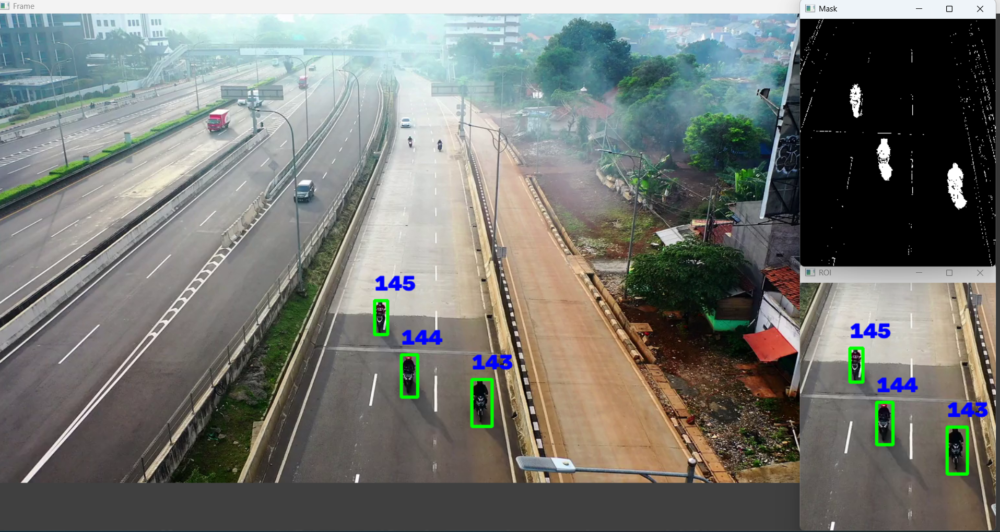

# 🚗 Object Tracking using OpenCV

A Python-based **multiple object tracking** project that uses **OpenCV**, **Background Subtraction (MOG2)**, and a **Euclidean Distance Tracker** to detect, track, and assign unique IDs to moving vehicles in a highway surveillance video.

---

## 📌 Features

- 🎥 Detect moving vehicles from a video
- 📍 Track multiple objects simultaneously
- 🆔 Assign unique IDs to each detected object
- 📦 Draw bounding boxes around tracked vehicles
- ⚡ Process a Region of Interest (ROI) for faster detection
- 🖥️ Display the original frame, ROI, and foreground mask in real time

---

## 📂 Project Structure

```text
Object_tracking/
│
├── 1. Video capture.py        # Read and display video frames
├── 2. White mask.py           # Generate foreground mask using MOG2
├── main.py                    # Main object tracking application
├── tracker.py                 # Euclidean Distance Tracker
├── highway.mp4                # Sample highway video
├── images
│   └── object_tracking_output.png     
├── README.md
└── requirements.txt
```

---

## 🛠️ Technologies Used

- Python 3.x
- OpenCV
- NumPy

---

## ⚙️ How It Works

1. Read video frames.
2. Select the Region of Interest (ROI).
3. Apply Background Subtraction (MOG2).
4. Generate a binary foreground mask.
5. Detect moving objects using contours.
6. Filter out small objects.
7. Track detected objects using a Euclidean Distance Tracker.
8. Assign unique IDs to each object.
9. Display tracking results in real time.

---

## 🔄 Workflow

```text
Video Input
     │
     ▼
Read Video Frame
     │
     ▼
Select ROI
     │
     ▼
Background Subtraction (MOG2)
     │
     ▼
Binary Threshold
     │
     ▼
Find Contours
     │
     ▼
Filter Small Objects
     │
     ▼
Create Bounding Boxes
     │
     ▼
Euclidean Distance Tracker
     │
     ▼
Assign Object IDs
     │
     ▼
Display Tracking Results
```

---

## ▶️ Installation

### Clone the repository

```bash
git clone https://github.com/manasranjanmeher99/Object_tracking.git
```

### Navigate to the project folder

```bash
cd Object_tracking
```

### Install dependencies

```bash
pip install -r requirements.txt
```

---

## ▶️ Run the Project

```bash
python main.py
```

Press **Esc** to exit the application.

---

## 📸 Project Output

The application displays three windows:

- **Frame** – Original video with tracked objects
- **ROI** – Region of Interest used for tracking
- **Mask** – Foreground mask generated using MOG2

Each detected vehicle is highlighted with:

- 🟩 Green bounding box
- 🔵 Unique tracking ID

### Sample Output


```text
images/object_tracking_output.png
```

Then display it using:



---

## 📁 File Description

### 📹 1. Video capture.py

Reads and displays video frames using OpenCV.

### ⚪ 2. White mask.py

Applies Background Subtraction (MOG2) to generate a foreground mask.

### 🚀 main.py

Main program that:

- Reads video frames
- Detects moving vehicles
- Tracks objects
- Assigns IDs
- Displays results

### 🎯 tracker.py

Implements the Euclidean Distance Tracker that:

- Calculates object centers
- Matches objects between frames
- Maintains unique IDs
- Removes disappeared objects

---

## 📦 Requirements

```text
opencv-python
numpy
```

Install them with:

```bash
pip install -r requirements.txt
```

---

## 🚀 Future Improvements

- YOLOv8 Vehicle Detection
- DeepSORT Tracking
- ByteTrack Integration
- Vehicle Counting
- Speed Estimation
- Lane Detection
- Traffic Analytics Dashboard

---


## 👨‍💻 Author

**Manas Ranjan Meher**

If you found this project helpful, consider giving it a ⭐ on GitHub!
